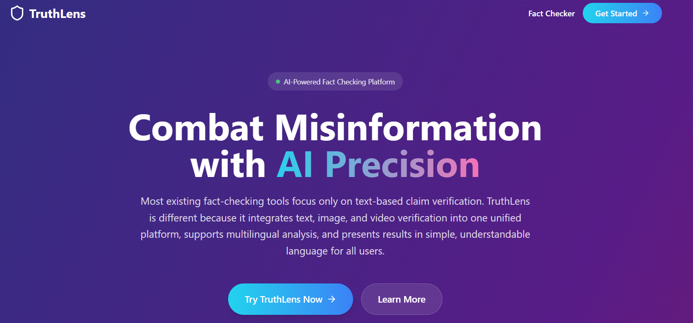
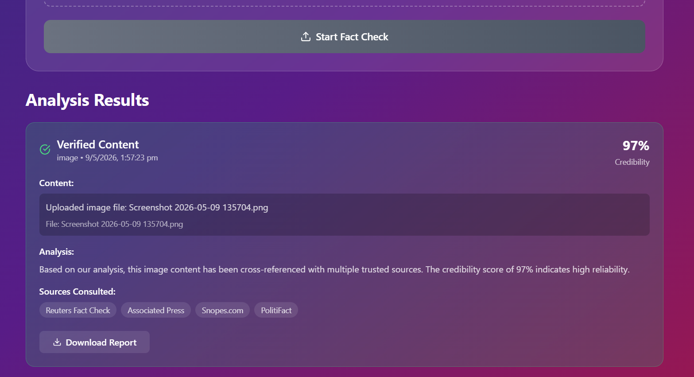

# GoogleNeuroNest-GenAI-Exchange-Hackathon
TruthLens is an AI-powered platform designed to detect and prevent the spread of  misinformation across text, images, and videos. It combines real-time fact-checking,  deepfake detection, multilingual analysis, and source credibility scoring into a single  solution. 

# 🛡️ TruthLens – AI-Powered Fact Checking Platform

<div align="center">


### 🚀 Combat Misinformation with AI Precision

TruthLens is an AI-powered misinformation detection and fact-checking platform that verifies text, images, and media content using intelligent credibility analysis and trusted source cross-referencing.

</div>

---

# 📸 Project Screenshots

## 🏠 Landing Page



---

## 📊 Analysis Results



---

# ✨ Features

✅ Real-time AI fact verification  
✅ Credibility score generation  
✅ Image & deepfake analysis simulation  
✅ Multilingual misinformation detection  
✅ Beautiful modern responsive UI  
✅ Trusted source referencing  
✅ Downloadable analysis reports  
✅ Interactive and user-friendly design  

---

# 🧠 Problem Statement

Misinformation spreads rapidly across social media and digital platforms. Existing fact-checking systems mainly focus on text verification and often fail to analyze multimedia content like images and videos effectively.

TruthLens solves this problem by combining:

- AI-powered verification
- Deepfake & image manipulation analysis
- Source credibility ranking
- Easy-to-understand explanations
- Unified media verification system

---

# 💡 Solution Overview

TruthLens allows users to upload or submit:

- 📝 Text Claims
- 🖼️ Images
- 🎥 Videos
- 🔗 URLs & Posts

The platform then:

1. Cross-checks information with trusted sources
2. Performs AI-driven credibility analysis
3. Detects manipulated or misleading media
4. Generates a credibility score
5. Presents results in a simple understandable format

---

# ⚙️ Tech Stack

| Technology | Purpose |
|---|---|
| React | Frontend Framework |
| TypeScript | Type Safety |
| Vite | Fast Build Tool |
| Tailwind CSS | UI Styling |
| PostCSS | CSS Processing |
| ESLint | Code Quality |

---

# 🛠️ Project Structure

```bash
TruthLens/
│
├── src/
│   ├── components/
│   │
│   ├── App.tsx
│   ├── main.tsx
│   ├── index.css
│   └── vite-env.d.ts
│
├── index.html
├── package.json
├── package-lock.json
├── vite.config.ts
├── tailwind.config.js
├── postcss.config.js
├── eslint.config.js
├── tsconfig.json
├── tsconfig.app.json
├── tsconfig.node.json
│
└── README.md
```

---

# 🚀 Installation & Setup

## 1️⃣ Clone the Repository

```bash
git clone https://github.com/Nidhi-hb/GoogleNeuroNest-GenAI-Exchange-Hackathon.git
```

---

## 2️⃣ Navigate to Project Directory

```bash
cd GoogleNeuroNest-GenAI-Exchange-Hackathon
```

---

## 3️⃣ Install Dependencies

```bash
npm install
```

---

## 4️⃣ Start Development Server

```bash
npm run dev
```

---

## 5️⃣ Build for Production

```bash
npm run build
```

---

# 📂 Important Files Explained

## 🔹 `App.tsx`

Main application UI and page rendering.

## 🔹 `main.tsx`

Application entry point.

## 🔹 `index.css`

Global styles and Tailwind imports.

## 🔹 `vite.config.ts`

Vite configuration settings.

## 🔹 `tailwind.config.js`

Tailwind customization and theme configuration.

## 🔹 `eslint.config.js`

Linting and code quality rules.

---

# 🎯 How TruthLens Works

## 1️⃣ Input Content

Users upload content such as text, images, videos, or links.

## 2️⃣ AI Analysis

AI algorithms analyze and compare content with trusted references and credibility databases.

## 3️⃣ Result Generation

The platform generates:
- Credibility Score
- Verification Status
- Trusted Sources
- Simplified Explanation

---

# 🔥 Key Highlights

- 🌍 Supports multilingual misinformation analysis
- 🖼️ Simulates deepfake/image forgery detection
- 📱 Fully responsive modern UI
- ⚡ Fast performance using Vite
- 🎨 Elegant gradient-based design system
- 📊 Clear credibility visualization

---

# 📱 Responsive Design

TruthLens is optimized for:

- 💻 Desktop
- 📱 Mobile
- 📲 Tablets

---

# 🎨 UI/UX Features

- Modern glassmorphism inspired cards
- Gradient-based interface
- Interactive buttons
- Clean typography
- Smooth responsive layout
- Accessibility-focused structure

---

# 🧪 Future Improvements

- Real AI model integration
- Google Fact Check API integration
- Live web verification
- Video misinformation detection
- User authentication
- History & analytics dashboard
- Browser extension support

---

# 🏆 Hackathon Project

This project was developed as part of the **Google NeuroNest GenAI Exchange Hackathon** initiative focused on solving real-world misinformation challenges using Generative AI concepts. :contentReference[oaicite:0]{index=0}

---

# 👩‍💻 Author

## Nidhi HB

🔗 GitHub: 
https://github.com/Nidhi-hb

🔗 Project Repository:
https://github.com/Nidhi-hb/GoogleNeuroNest-GenAI-Exchange-Hackathon

---

# ⭐ Support

If you liked this project:

🌟 Star the repository  
🍴 Fork the project  
📢 Share with others  

---

# 📄 License

This project is created for educational and hackathon purposes.

---

<div align="center">

## 🚀 TruthLens – Fighting Misinformation with AI

Made with ❤️ using React, TypeScript & Tailwind CSS

</div>
